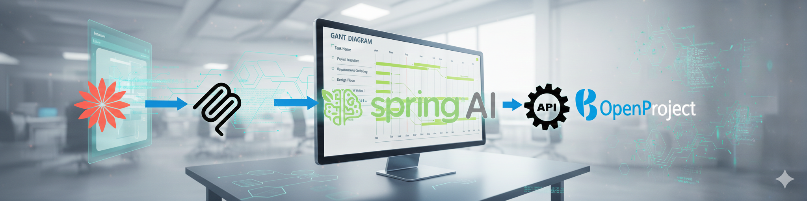
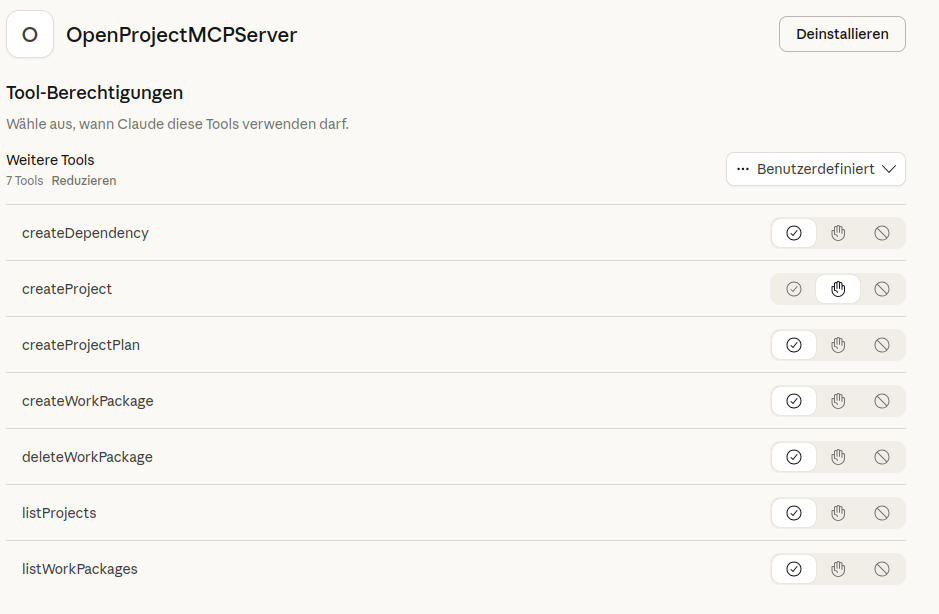
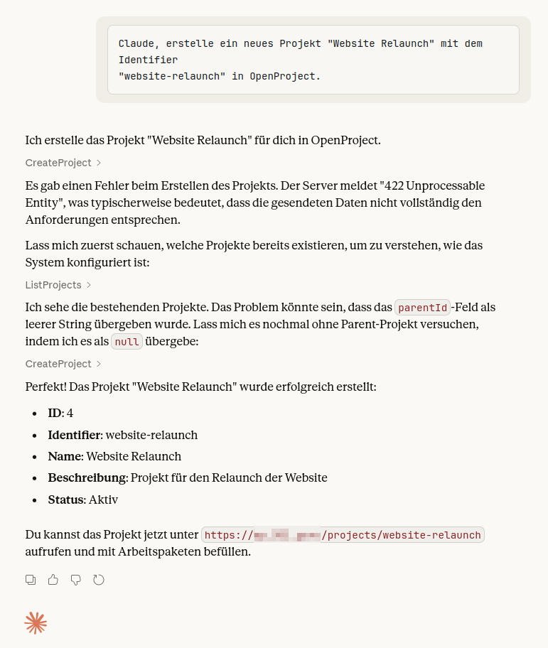
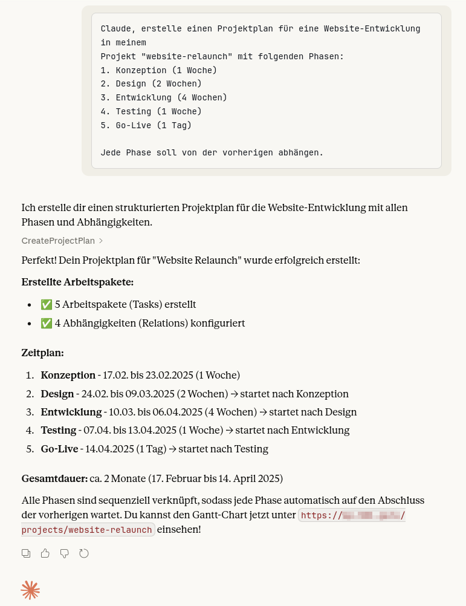
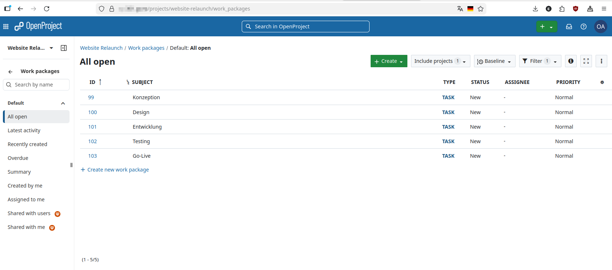
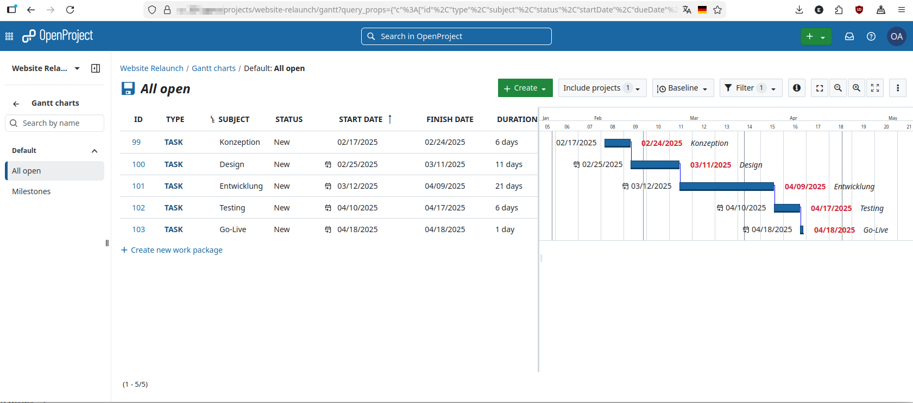

# OpenProject MCP Server

Ein MCP (Model Context Protocol) Server für die Integration von OpenProject mit Claude. Ermöglicht es Claude, Gantt-Diagramme und Projektpläne direkt in OpenProject anzulegen.

> **⚠️ WICHTIGER HINWEIS:** Dies ist ein **reines Testprojekt** ohne jegliche Session-Verwaltung, Berechtigungen oder Autorisierung. Es ist **NICHT für den Produktiveinsatz** geeignet! Das Projekt dient ausschließlich zu Demonstrations- und Lernzwecken und steht in keiner offiziellen Verbindung zu OpenProject GmbH, Anthropic, Broadcom oder anderen genannten Unternehmen.

## Features

- **listProjects** - Alle zugänglichen Projekte auflisten
- **createProject** - Neues Projekt anlegen
- **listWorkPackages** - Arbeitspakete eines Projekts auflisten
- **createWorkPackage** - Einzelnes Arbeitspaket anlegen
- **createDependency** - Abhängigkeit zwischen Arbeitspaketen erstellen (für Gantt)
- **createProjectPlan** - Kompletten Projektplan mit mehreren Tasks und Abhängigkeiten in einem Aufruf erstellen
- **deleteWorkPackage** - Arbeitspaket löschen

## Technologie

- **Spring Boot 3.4.4** mit WebFlux
- **Spring AI 1.1.2** mit MCP Server Support
- **MCP Protocol 2025-03-26** (Streamable HTTP Transport)
- Java 21+
- Maven 3.8+

## Voraussetzungen

- Java 21+
- Maven 3.8+
- OpenProject Instanz mit API-Zugang

## Schnellstart

### 1. API-Key in OpenProject erstellen

1. In OpenProject einloggen
2. Zu **My Account → Access Tokens → API** navigieren
3. Neuen Token erstellen und kopieren

### 2. Umgebungsvariablen setzen

```bash
export OPENPROJECT_BASE_URL=https://your-instance.openproject.com
export OPENPROJECT_API_KEY=your-api-key-here
```

### 3. Bauen und Starten

```bash
# Abhängigkeiten herunterladen und bauen
mvn clean package

# Server starten
mvn spring-boot:run
```

Der MCP Server läuft nun auf `http://localhost:8787/mcp`.

## Tests

### Unit Tests (mit WireMock)

```bash
mvn test
```

### Integration Tests gegen echte OpenProject API

```bash
export OPENPROJECT_BASE_URL=https://your-instance.openproject.com
export OPENPROJECT_API_KEY=your-api-key
export OPENPROJECT_TEST_PROJECT=your-test-project-slug

mvn test -Dtest=OpenProjectClientRealApiTest
```

## Deployment

### Lokaler Test mit test-mcp.sh

```bash
# Lokaler Server
./test-mcp.sh http://localhost:8787

# Remote Server
./test-mcp.sh https://www.example.com
```

Das Script testet alle MCP-Funktionen (Initialize, List Tools, List Projects, etc.).

### Verbindung mit claude.ai

1. Server mit HTTPS deployen (z.B. Hetzner + Apache/nginx + Let's Encrypt)
2. Reverse Proxy konfigurieren:
   ```apache
   # Apache: /mcp an MCP-Server weiterleiten
   ProxyPass /mcp http://localhost:8787/mcp
   ProxyPassReverse /mcp http://localhost:8787/mcp
   ```
3. In claude.ai: **Settings → Integrations → Add MCP Server**
4. URL eingeben: `https://www.example.com/mcp`
5. Transport: **HTTP** (Streamable HTTP)

## Projektstruktur

```
openproject-mcp/
├── pom.xml
├── src/main/java/rocks/euu/mcp/
│   ├── OpenProjectMcpApplication.java    # Main Application
│   ├── config/
│   │   ├── McpToolConfig.java            # MCP Tool Registration
│   │   ├── OpenProjectProperties.java    # Configuration Properties
│   │   └── WebClientConfig.java          # HTTP Client Config
│   ├── client/
│   │   └── OpenProjectClient.java        # OpenProject API Client
│   ├── model/
│   │   ├── Project.java                  # Project Model
│   │   ├── Relation.java                 # Relation Model
│   │   └── WorkPackage.java              # Work Package Model
│   └── tools/
│       └── OpenProjectTools.java         # MCP Tools
└── src/test/java/rocks/euu/mcp/
    ├── client/
    │   ├── OpenProjectClientTest.java        # WireMock Tests
    │   └── OpenProjectClientRealApiTest.java # Real API Tests
    └── tools/
        └── OpenProjectToolsTest.java         # Unit Tests
```

## Beispiele

### Projekt anlegen mit Claude AI


**Live-Beispiel:**



*Claude AI nutzt das MCP-Tool `createProject`*

Claude kann direkt Projekte in OpenProject anlegen:

```
Claude, erstelle ein neues Projekt "Website Relaunch" mit dem Identifier 
"website-relaunch" in OpenProject.
```



*Das Projekt wird in OpenProject angelegt*


### Projektplan mit Claude erstellen

```
Claude, erstelle einen Projektplan für eine Website-Entwicklung in meinem 
Projekt "website-relaunch" mit folgenden Phasen:
1. Konzeption (1 Woche)
2. Design (2 Wochen) 
3. Entwicklung (4 Wochen)
4. Testing (1 Woche)
5. Go-Live (1 Tag)

Jede Phase soll von der vorherigen abhängen.
```

Claude wird dann die `createProjectPlan` Funktion nutzen, um alle Arbeitspakete mit Abhängigkeiten anzulegen.




*Bestätigung mit Projekt-ID und Details*



*Das neue Projekt erscheint in der OpenProject-Oberfläche*



*Alle Details wurden korrekt übernommen*


## Lizenz

MIT
